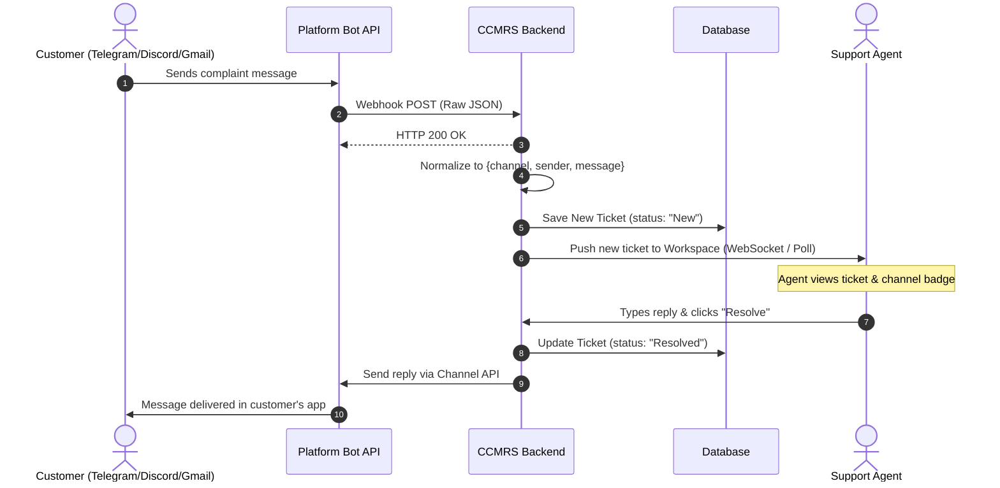
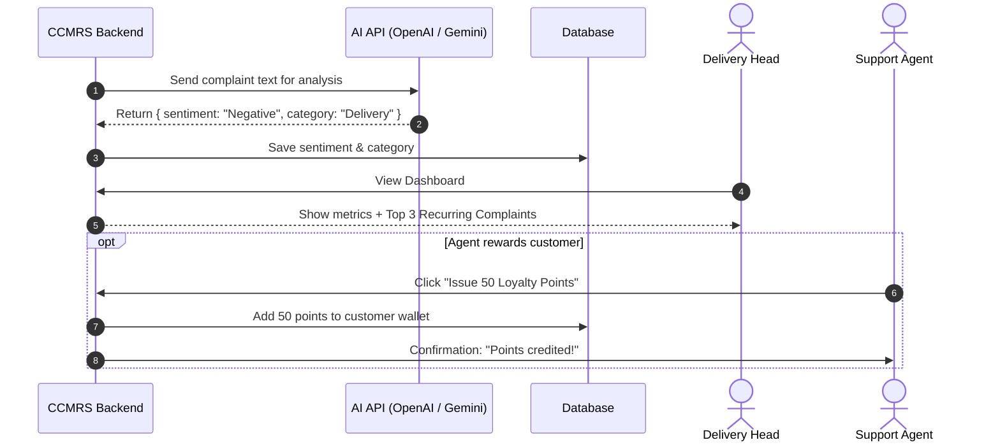
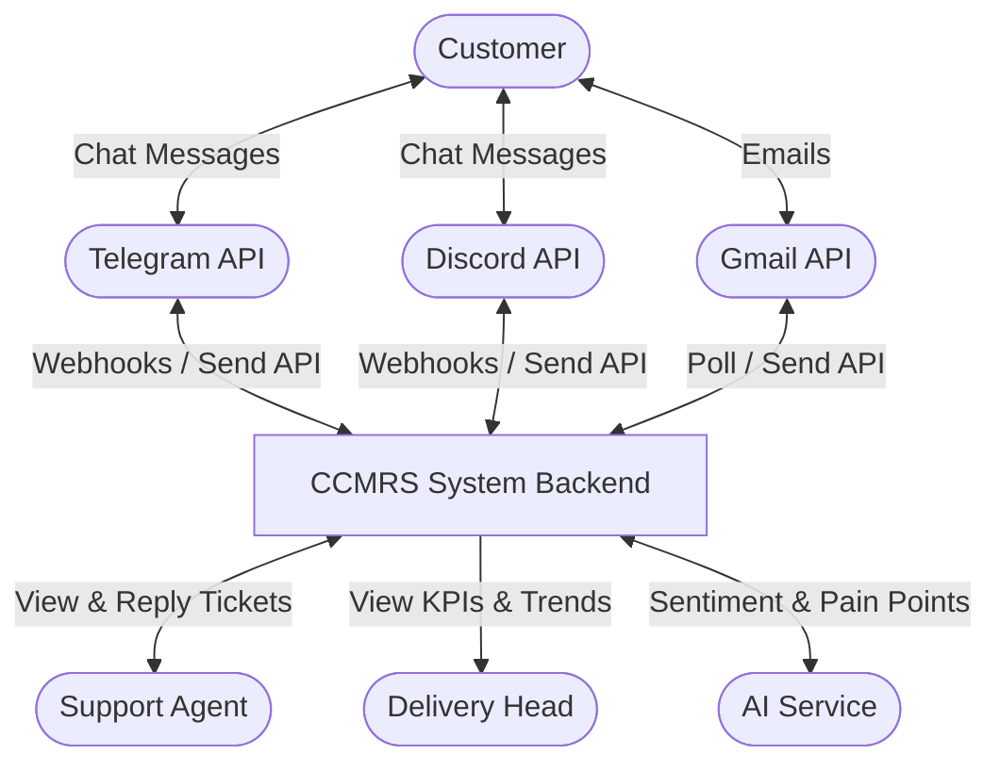
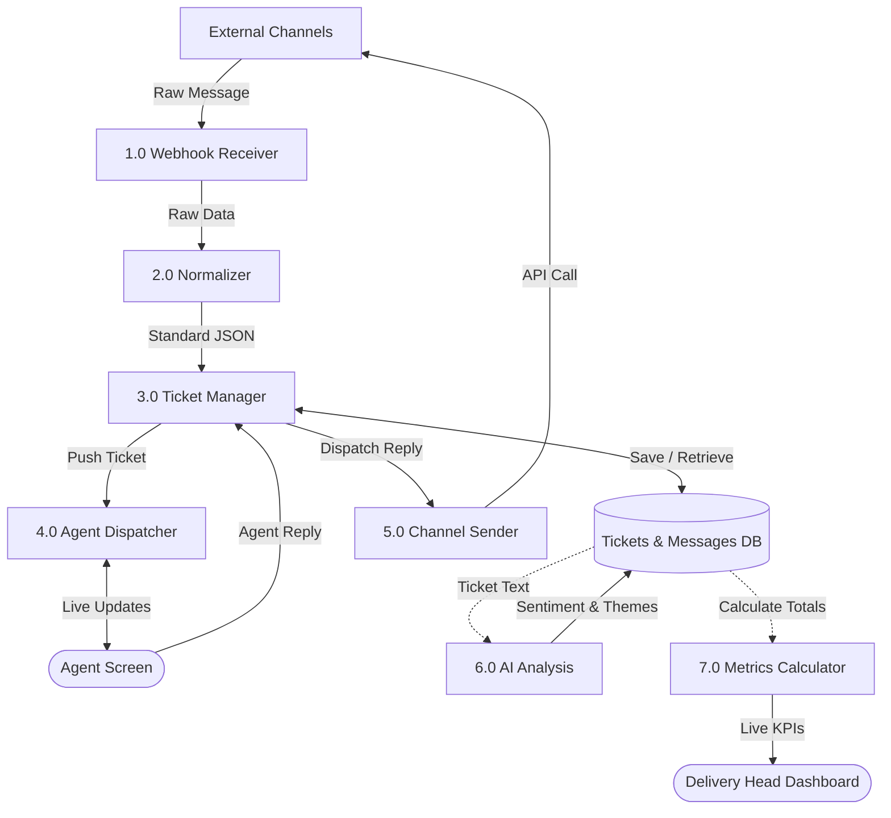
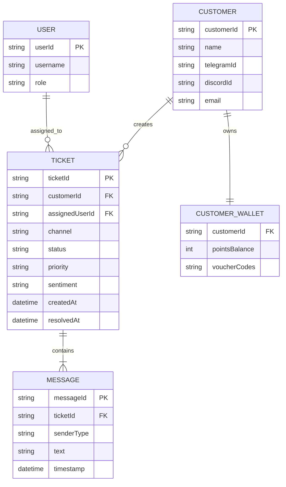

# Software Requirements Specification (SRS)
## Omnichannel Customer Complaint Management & Resolution System (CCMRS)

**Document Version:** 1.0  
**Date:** 12 September 2026  
**Academic Semester:** B.Tech SEM-5 (Software Engineering Project)  
**Role:** Solutions Architect  
**Project Team ("Bachelor Squad"):**  
- Vivek (Solutions Architect / QA)  
- Sarthak Tajane (Project Lead)  
- Prasad Bhad (Business Analyst)  
- Swaraj (Tech Lead)  

---

## Table of Contents
- [1. Introduction](#1-introduction)
  - [1.1 Purpose](#11-purpose)
  - [1.2 Scope](#12-scope)
  - [1.3 Definitions, Acronyms, and Abbreviations](#13-definitions-acronyms-and-abbreviations)
  - [1.4 References](#14-references)
  - [1.5 Overview](#15-overview)
- [2. General Description](#2-general-description)
  - [2.1 Product Perspective](#21-product-perspective)
  - [2.2 Product Functions](#22-product-functions)
  - [2.3 User Characteristics](#23-user-characteristics)
  - [2.4 General Constraints](#24-general-constraints)
  - [2.5 Assumptions and Dependencies](#25-assumptions-and-dependencies)
- [3. Specific Requirements](#3-specific-requirements)
  - [3.1 External Interface Requirements](#31-external-interface-requirements)
    - [3.1.1 User Interfaces](#311-user-interfaces)
    - [3.1.2 Hardware Interfaces](#312-hardware-interfaces)
    - [3.1.3 Software Interfaces](#313-software-interfaces)
    - [3.1.4 Communications Interfaces](#314-communications-interfaces)
  - [3.2 Functional Requirements](#32-functional-requirements)
    - [3.2.1 Multi-Channel Message Capture](#321-multi-channel-message-capture)
    - [3.2.2 Message Normalization](#322-message-normalization)
    - [3.2.3 Ticket Creation and Lifecycle Management](#323-ticket-creation-and-lifecycle-management)
    - [3.2.4 Real-Time Agent Workspace and Reply Dispatch](#324-real-time-agent-workspace-and-reply-dispatch)
    - [3.2.5 Delivery Head Dashboard & Performance Metrics](#325-delivery-head-dashboard--performance-metrics)
    - [3.2.6 AI Sentiment Analysis & Recurring Complaint Grouping](#326-ai-sentiment-analysis--recurring-complaint-grouping)
    - [3.2.7 Customer Loyalty & Digital Wallet Rewards](#327-customer-loyalty--digital-wallet-rewards)
    - [3.2.8 User Authentication & Role-Based Access](#328-user-authentication--role-based-access)
  - [3.3 Use Cases](#33-use-cases)
    - [3.3.1 Use Case 1: Inbound Complaint Ingestion & Auto-Ticketing](#331-use-case-1-inbound-complaint-ingestion--auto-ticketing)
    - [3.3.2 Use Case 2: Agent Views Ticket and Replies to Customer](#332-use-case-2-agent-views-ticket-and-replies-to-customer)
    - [3.3.3 Use Case 3: Delivery Head Monitors Dashboard and AI Insights](#333-use-case-3-delivery-head-monitors-dashboard-and-ai-insights)
    - [3.3.4 Use Case 4: AI Recommends Loyalty Credit to Digital Wallet](#334-use-case-4-ai-recommends-loyalty-credit-to-digital-wallet)
  - [3.4 Classes / Objects](#34-classes--objects)
    - [3.4.1 Ticket](#341-ticket)
    - [3.4.2 Message](#342-message)
    - [3.4.3 User (Agent / Delivery Head)](#343-user-agent--delivery-head)
    - [3.4.4 Customer](#344-customer)
    - [3.4.5 AIInsight](#345-aiinsight)
  - [3.5 Non-Functional Requirements](#35-non-functional-requirements)
    - [3.5.1 Performance](#351-performance)
    - [3.5.2 Reliability](#352-reliability)
    - [3.5.3 Availability](#353-availability)
    - [3.5.4 Security](#354-security)
    - [3.5.5 Maintainability](#355-maintainability)
    - [3.5.6 Portability](#356-portability)
  - [3.6 Inverse Requirements](#36-inverse-requirements)
  - [3.7 Design Constraints](#37-design-constraints)
  - [3.8 Logical Database Requirements](#38-logical-database-requirements)
  - [3.9 Other Requirements](#39-other-requirements)
- [4. Analysis Models](#4-analysis-models)
  - [4.1 Sequence Diagrams](#41-sequence-diagrams)
  - [4.2 Data Flow Diagrams (DFD)](#42-data-flow-diagrams-dfd)
  - [4.3 Entity Relationship Diagrams (ERD)](#43-entity-relationship-diagrams-erd)
- [5. Change Management Process](#5-change-management-process)
- [A. Appendices](#a-appendices)
  - [A.1 Appendix 1: Normalized JSON Payload Sample](#a1-appendix-1-normalized-json-payload-sample)
  - [A.2 Appendix 2: Sample AI Prompt and Response Format](#a2-appendix-2-sample-ai-prompt-and-response-format)

---

# 1. Introduction

## 1.1 Purpose
The purpose of this Software Requirements Specification (SRS) is to describe the functional and non-functional requirements for the **Omnichannel Customer Complaint Management & Resolution System (CCMRS)**. This document serves as the implementation guideline for our 5th-semester college project and defines how incoming messages across multiple social platforms are converted into tickets, routed to agents, and summarized for management.

## 1.2 Scope
CCMRS provides a centralized web application to manage customer complaints arriving from multiple digital channels.

### In Scope:
1. **Multi-Channel Ingestion:** Capturing customer messages from **Telegram**, **Discord**, and **Gmail**.
2. **Payload Normalization:** Converting different platform message structures into a single consistent JSON format.
3. **Ticket Management:** Automatically creating tickets with unique IDs, basic priority, and status transitions (`New` $\to$ `In Progress` $\to$ `Resolved` $\to$ `Closed`).
4. **Unified Agent Workspace:** A web screen where support agents can view tickets tagged with channel icons and reply directly back to the customer's native app.
5. **Delivery Head Dashboard:** An overview screen showing total complaints, resolved complaints, agent workload, and average resolution times.
6. **Simple AI Assistant:** Using an LLM API call (e.g., OpenAI / Gemini / Bedrock) to detect message sentiment (Positive / Neutral / Negative), list recurring complaints, and suggest small wallet loyalty points/discounts.
7. **Mock Digital Wallet:** A straightforward database table to store customer reward points and vouchers.

### Out of Scope:
1. Developing new social networks or email services.
2. Complex telecommunication hardware or physical PBX systems.
3. Real monetary banking transactions (the wallet uses simulated points/vouchers).
4. Offline or paper grievance forms.

## 1.3 Definitions, Acronyms, and Abbreviations
- **AHT:** Average Handling Time (how long an agent takes to resolve a ticket).
- **API:** Application Programming Interface.
- **CCMRS:** Omnichannel Customer Complaint Management & Resolution System.
- **JSON:** JavaScript Object Notation (data format used between services).
- **LLM:** Large Language Model (used for sentiment analysis and summary).
- **Normalized Data:** Putting data from different platforms into the same structure.
- **SRS:** Software Requirements Specification.
- **Webhook:** A web callback HTTP POST sent automatically when an event occurs.

## 1.4 References
1. IEEE Recommended Practice for Software Requirements Specifications (IEEE Std 830-1998).
2. CCMRS Business Requirements Document (BRD) v0.2.
3. CCMRS Scope of Work (SOW) v1.0.
4. Telegram Bot API and Discord Developer Documentation.

## 1.5 Overview
The rest of this document covers:
- **Section 2:** General product overview, architecture diagram, user roles, and constraints.
- **Section 3:** Detailed functional specifications, use cases, classes, and performance criteria.
- **Section 4:** Analysis models including Sequence Diagrams, DFDs (Level 0 and 1), and ER Diagram.
- **Section 5 & Appendices:** Change control process, JSON format, and sample AI prompts.

---

# 2. General Description

## 2.1 Product Perspective
CCMRS connects external platforms to a central Node.js/Python web backend. Customer messages sent on Telegram, Discord, or Gmail are converted into tickets. Agents reply from a single dashboard, and the backend sends the message back to the customer via the originating channel API.

```
+-------------------------------------------------------------------+
|               CUSTOMER CHANNELS (Telegram, Discord, Gmail)        |
+---------------------------------+---------------------------------+
                                  | Webhook / Polling
                                  v
+-------------------------------------------------------------------+
|                         CCMRS BACKEND SERVER                      |
|  1. Ingestion Endpoint  -->  2. Normalizer  -->  3. Database      |
|                                                     (Tickets)     |
+-------------------+-----------------------------+-----------------+
                    | WebSocket / Polling         | Scheduled / Trigger
                    v                             v
+-----------------------------------+     +-------------------------+
|      AGENT WORKSPACE (Web UI)     |     | DELIVERY HEAD DASHBOARD |
| - View Assigned Tickets           |     | - Total & Resolved KPIs |
| - Source Channel Icon (TG/DC/GM)  |     | - Agent Load            |
| - Reply Directly to Customer      |     | - AI Complaint Clusters |
+-----------------------------------+     +-------------------------+
```

## 2.2 Product Functions
1. **Listen for Messages:** Receives instant webhooks from Telegram and Discord, and periodically checks Gmail.
2. **Standardize Messages:** Converts all messages into: `{ channel, sender, message, timestamp }`.
3. **Generate Tickets:** Inserts a ticket record into the database with status `New`.
4. **Real-Time Display:** Pushes new tickets to the agent workspace via WebSockets or simple polling.
5. **Send Replies Back:** When an agent types a response, the system calls Telegram/Discord/Gmail API to reply to the user.
6. **Track Status:** Updates ticket state (`New` $\to$ `In Progress` $\to$ `Resolved` $\to$ `Closed`).
7. **Calculate Dashboard Metrics:** Computes daily totals, resolution counts, and average handling time.
8. **Run AI Summaries:** Calls an AI API to get sentiment and identify recurring customer pain points.
9. **Assign Loyalty Rewards:** Suggests discount credits into a mock customer wallet.

## 2.3 User Characteristics
- **Support Agent:** Needs an easy, single-screen inbox ("My Tickets") with a conversation view and a quick reply box.
- **Delivery Head:** Needs an executive summary: total volume, resolved vs. open tickets, agent workload, and top complaint categories.
- **Customer:** Interacts only through their normal messaging apps; does not log into CCMRS.
- **System Admin:** Manages user login credentials and channel API keys.

## 2.4 General Constraints
1. **College Project Scope:** Must run locally or on a standard cloud free-tier (AWS Free Tier, Azure Student, or Render/Heroku).
2. **API Quotas:** Must respect free-tier rate limits on Telegram Bot and Discord APIs.
3. **Web Standards:** Web interface built using standard HTML/CSS/JavaScript or React.
4. **Simple AI Calls:** AI analysis relies on standard API calls rather than complex custom model training.

## 2.5 Assumptions and Dependencies
- Valid API keys/tokens are generated for Telegram Bot, Discord Bot, and Gmail API.
- Users have an active internet connection to receive webhooks and access the dashboard.
- LLM API service (OpenAI / Gemini / Bedrock) remains accessible.

---

# 3. Specific Requirements

## 3.1 External Interface Requirements

### 3.1.1 User Interfaces
1. **Support Agent Workspace:**
   - **Ticket List:** Shows tickets assigned to the agent. Each card displays Ticket ID, customer name, status badge, and channel logo (Telegram paper plane, Discord icon, Gmail envelope).
   - **Chat Box:** Displays past messages in chronological order.
   - **Reply Area:** A text box with a `Send Reply` button and a `Resolve Ticket` button.
   - **AI Suggestion Box:** Shows detected sentiment (e.g., "Negative - Delayed Order") and a button to award a 10% loyalty discount code.

2. **Delivery Head Dashboard:**
   - **Top KPI Cards:** Four summary counters: `Total Inbound`, `Resolved Today`, `Pending Tickets`, `Avg Resolution Time`.
   - **Unified Live Feed:** A table of all recent tickets across all three channels.
   - **Agent Workload List:** Shows each agent's name and number of active tickets.
   - **AI Recurring Pain Points Panel:** A ranked list of the top 3–5 customer complaint categories with percentage share.

### 3.1.2 Hardware Interfaces
Standard laptop or PC with a modern web browser and internet connection.

### 3.1.3 Software Interfaces
- **Telegram Bot API:** Receives webhook updates; sends messages via `POST /sendMessage`.
- **Discord Bot API:** Receives channel webhooks; sends messages via `POST /channels/{id}/messages`.
- **Gmail API:** Reads inbox via `users.messages.list`; sends replies via `users.messages.send`.
- **Database:** MongoDB, DynamoDB, or MySQL to store tickets, users, and messages.
- **AI API:** OpenAI or Gemini REST API to classify sentiment and group pain points.

### 3.1.4 Communications Interfaces
Standard HTTPS (Port 443) for API routes; WebSockets or HTTP Polling (every 5 seconds) for real-time frontend updates.

---

## 3.2 Functional Requirements

### 3.2.1 Multi-Channel Message Capture
- **3.2.1.1 Introduction:** Receives messages sent by customers on Telegram, Discord, and Gmail.
- **3.2.1.2 Inputs:** Webhook HTTP request body from Telegram/Discord; polled email message from Gmail.
- **3.2.1.3 Processing:** Verifies request authenticity; returns an instant HTTP 200 response to prevent timeouts; sends raw data to the normalizer.
- **3.2.1.4 Outputs:** Raw message object forwarded to normalizer.
- **3.2.1.5 Error Handling:** Invalid or unverified webhook requests return HTTP 400 and are discarded.

### 3.2.2 Message Normalization
- **3.2.2.1 Introduction:** Converts differing message formats into one standard shape.
- **3.2.2.2 Inputs:** Raw platform payload.
- **3.2.2.3 Processing:** Extracts sender ID, channel name, text body, and timestamp into:
  `{ channel: "telegram", senderId: "12345", senderName: "John", message: "text", timestamp: "ISO" }`.
- **3.2.2.4 Outputs:** Normalized message object.
- **3.2.2.5 Error Handling:** If required fields (e.g., text content) are missing, a default message string is assigned.

### 3.2.3 Ticket Creation and Lifecycle Management
- **3.2.3.1 Introduction:** Automatically creates and updates complaint tickets.
- **3.2.3.2 Inputs:** Normalized message object.
- **3.2.3.3 Processing:** 
  - Checks if an active ticket exists for this customer.
  - If exists: Appends message to the ongoing conversation.
  - If new: Generates a new ticket (`TICK-001`), sets status to `New`, assigns priority based on keywords, and saves to database.
- **3.2.3.4 Outputs:** Saved Ticket record in the database.
- **3.2.3.5 Error Handling:** Database save failures retry once before logging an error.

### 3.2.4 Real-Time Agent Workspace and Reply Dispatch
- **3.2.4.1 Introduction:** Displays tickets to support agents and dispatches agent replies back to the customer.
- **3.2.4.2 Inputs:** New ticket event (inbound); agent text reply and status selection (outbound).
- **3.2.4.3 Processing:**
  - Pushes new ticket to the agent workspace UI.
  - When the agent clicks `Send Reply`, backend checks the ticket's `channel` field and calls the respective Telegram, Discord, or Gmail send API.
  - Updates ticket status to `In Progress` or `Resolved`.
- **3.2.4.4 Outputs:** Reply message delivered to customer on their original platform; ticket updated on screen.
- **3.2.4.5 Error Handling:** If the platform API fails, displays an alert: *"Failed to send reply to Telegram. Please try again."*

### 3.2.5 Delivery Head Dashboard & Performance Metrics
- **3.2.5.1 Introduction:** Provides management with aggregated operational metrics.
- **3.2.5.2 Inputs:** Ticket table records.
- **3.2.5.3 Processing:** Queries total tickets, resolved count, active tickets per agent, and calculates Average Handling Time.
- **3.2.5.4 Outputs:** Rendered charts and metric cards on the Delivery Head web page.
- **3.2.5.5 Error Handling:** If metrics calculation fails, displays previous cached numbers.

### 3.2.6 AI Sentiment Analysis & Recurring Complaint Grouping
- **3.2.6.1 Introduction:** Runs an AI evaluation on complaint texts.
- **3.2.6.2 Inputs:** Ticket complaint text.
- **3.2.6.3 Processing:**
  - Passes text to an LLM prompt asking for: Sentiment (Positive/Neutral/Negative) and Category (e.g., Delivery, Payment, Damaged Item).
  - Groups recent tickets to compile a list of the **Top 5 Recurring Pain Points** for the dashboard.
- **3.2.6.4 Outputs:** Sentiment tag on ticket; Top 5 list on Delivery Head dashboard.
- **3.2.6.5 Error Handling:** If AI API call fails or times out, defaults to `Neutral` sentiment without breaking ticket flow.

### 3.2.7 Customer Loyalty & Digital Wallet Rewards
- **3.2.7.1 Introduction:** Generates customer compensation rewards.
- **3.2.7.2 Inputs:** Agent clicking `Issue Reward` button on a negative ticket.
- **3.2.7.3 Processing:** Creates a loyalty voucher record (e.g., 50 reward points or 10% coupon) in the customer's wallet table and sends notification code to customer.
- **3.2.7.4 Outputs:** Updated wallet balance; voucher code sent in chat.
- **3.2.7.5 Error Handling:** Prevents duplicate voucher creation on the same ticket.

### 3.2.8 User Authentication & Role-Based Access
- **3.2.8.1 Introduction:** Secure login for agents and management.
- **3.2.8.2 Inputs:** Username and password.
- **3.2.8.3 Processing:** Validates credentials; returns session token; directs `Agent` to Agent Workspace and `Delivery Head` to Executive Dashboard.
- **3.2.8.4 Outputs:** Authenticated user session.
- **3.2.8.5 Error Handling:** Invalid credentials return error: *"Invalid username or password."*

---

## 3.3 Use Cases

### 3.3.1 Use Case 1: Inbound Complaint Ingestion & Auto-Ticketing
- **Actor:** Customer.
- **Preconditions:** Customer sends a message on Telegram, Discord, or Gmail.
- **Main Flow:**
  1. Customer messages the Telegram bot: *"I received the wrong item for order #102."*
  2. Telegram sends webhook to CCMRS backend.
  3. Backend normalizes payload into standard JSON.
  4. System generates Ticket `TICK-101` with status `New` and channel `telegram`.
  5. Ticket appears immediately on the Agent Workspace with a Telegram icon.
- **Postconditions:** Ticket is recorded in the database and visible to agents.

### 3.3.2 Use Case 2: Agent Views Ticket and Replies to Customer
- **Actor:** Support Agent.
- **Preconditions:** Agent is logged into the workspace with assigned tickets.
- **Main Flow:**
  1. Agent selects ticket `TICK-101`.
  2. Agent reads customer grievance and conversation history.
  3. Agent types: *"We are arranging a replacement immediately."*
  4. Agent clicks `Send Reply & Mark Resolved`.
  5. Backend calls Telegram Bot API `sendMessage`.
  6. Customer receives the response directly in their Telegram chat.
  7. Ticket status changes to `Resolved`.
- **Postconditions:** Customer receives reply on native channel; ticket marked resolved.

### 3.3.3 Use Case 3: Delivery Head Monitors Dashboard and AI Insights
- **Actor:** Delivery Head.
- **Preconditions:** Delivery Head logs into the system.
- **Main Flow:**
  1. System displays dashboard with total complaints, resolved tickets, and active agent loads.
  2. Delivery Head views the **AI Recurring Pain Points Panel**, which shows:
     - `#1: Delayed Delivery (40%)`
     - `#2: Wrong Item Received (25%)`
     - `#3: Payment Refund Issues (15%)`
  3. Delivery Head notices Agent Rahul has 8 pending tickets while Agent Priya has 1.
  4. Delivery Head clicks to reassign 3 tickets to Priya.
- **Postconditions:** Workload is balanced; management understands top customer complaints.

### 3.3.4 Use Case 4: AI Recommends Loyalty Credit to Digital Wallet
- **Actor:** Support Agent, AI Assistant.
- **Preconditions:** Ticket has high negative sentiment.
- **Main Flow:**
  1. AI analyzes customer complaint text and tags sentiment as `Negative`.
  2. AI widget displays: *"Suggested Action: 50 Loyalty Points ($5 discount) for service apology."*
  3. Agent clicks `Issue 50 Points`.
  4. Backend adds 50 points to customer's wallet record.
  5. Backend sends automated confirmation to customer on their active channel.
- **Postconditions:** Customer wallet credited; reward recorded on ticket.

---

## 3.4 Classes / Objects

```
+------------------------------------+       +------------------------------------+
|               Ticket               |       |              Message               |
+------------------------------------+       +------------------------------------+
| - ticketId: String                 |       | - messageId: String                |
| - channel: String                  | 1   * | - ticketId: String                 |
| - customerId: String               |------>| - senderType: String (User/Agent)  |
| - agentId: String                  |       | - text: String                     |
| - status: String (New/Resolved)    |       | - timestamp: DateTime              |
| - priority: String                 |       +------------------------------------+
| - sentiment: String                |
+------------------------------------+
| + createTicket()                   |
| + updateStatus()                   |
| + assignAgent()                    |
+------------------------------------+
```

### 3.4.1 Ticket
- **Attributes:** `ticketId`, `channel` (`telegram`, `discord`, `gmail`), `customerId`, `assignedAgentId`, `status` (`New`, `In Progress`, `Resolved`, `Closed`), `priority` (`High`, `Medium`, `Low`), `sentiment` (`Positive`, `Neutral`, `Negative`), `createdAt`, `resolvedAt`.
- **Functions:** `createTicket()`, `updateStatus()`, `assignToAgent()`.
- **References:** Functional Requirements 3.2.3, 3.2.4; Use Cases 3.3.1, 3.3.2.

### 3.4.2 Message
- **Attributes:** `messageId`, `ticketId`, `senderName`, `senderType` (`customer`, `agent`), `text`, `timestamp`.
- **Functions:** `saveMessage()`, `sendToChannel()`.
- **References:** Functional Requirements 3.2.2, 3.2.4.

### 3.4.3 User (Agent / Delivery Head)
- **Attributes:** `userId`, `name`, `email`, `role` (`agent`, `delivery_head`), `activeTicketCount`.
- **Functions:** `login()`, `logout()`.
- **References:** Functional Requirement 3.2.8.

### 3.4.4 Customer
- **Attributes:** `customerId`, `name`, `telegramId`, `discordId`, `email`, `walletBalance`.
- **Functions:** `updateWalletBalance()`, `getTicketHistory()`.
- **References:** Functional Requirements 3.2.3, 3.2.7.

### 3.4.5 AIInsight
- **Attributes:** `insightId`, `categoryName`, `frequencyCount`, `sentimentRatio`.
- **Functions:** `generateSummary()`, `rankPainPoints()`.
- **References:** Functional Requirement 3.2.6; Use Case 3.3.3.

---

## 3.5 Non-Functional Requirements

### 3.5.1 Performance
- **Web Page Load:** Pages should load within **2 to 3 seconds** on standard internet connections.
- **Message Latency:** Inbound messages should appear on the agent screen within **2 seconds** of webhook reception.
- **Dashboard Refresh:** Delivery Head metrics should update automatically every **30 to 60 seconds**.

### 3.5.2 Reliability
- **No Lost Messages:** Every incoming message received by the webhook must be stored in the database.
- **Graceful Failure:** If Telegram or Discord API is down, the system should show an error message rather than crashing.

### 3.5.3 Availability
- Designed for 99% uptime during project demonstration and testing hours.

### 3.5.4 Security
- Passwords must be hashed (e.g., using `bcrypt`) before saving in the database.
- Standard session authentication (JWT or session cookies) to protect agent and dashboard pages.
- Role restriction: Support agents cannot access the Delivery Head management screens.

### 3.5.5 Maintainability
- Modular code structure: Channel integrations are kept in separate helper files (`telegramHelper.js`, `discordHelper.js`, `gmailHelper.js`).

### 3.5.6 Portability
- Runs in any modern web browser (Google Chrome, Firefox, Safari, Edge).
- Can be hosted on any standard OS (Windows, macOS, Linux) with Node.js / Python installed.

---

## 3.6 Inverse Requirements
- The system shall **NOT** send an agent reply to a different platform than where the message originated (e.g., a Discord message must never receive a reply via Telegram).
- The system shall **NOT** allow agents to edit or delete existing customer messages.
- The system shall **NOT** store plain-text passwords in the database.
- The system shall **NOT** allow support agents to view managerial performance reviews of other agents.

---

## 3.7 Design Constraints
- Built using accessible open-source web technologies (Node.js/Express or Python/Flask, HTML/CSS/JavaScript or React).
- Relies on free developer tier API keys for Telegram and Discord bots.
- Database can be MongoDB Atlas Free Tier, SQLite, or AWS DynamoDB.

---

## 3.8 Logical Database Requirements
Simple and direct database collection/table structures:

1. **`Tickets` Table:**
   - `ticket_id` (Primary Key, String)
   - `channel` (String: 'telegram' | 'discord' | 'gmail')
   - `customer_id` (String)
   - `assigned_agent_id` (String)
   - `status` (String: 'New', 'In Progress', 'Resolved')
   - `priority` (String: 'Low', 'Medium', 'High')
   - `sentiment` (String: 'Positive', 'Neutral', 'Negative')
   - `created_at` (Timestamp)
   - `resolved_at` (Timestamp, Nullable)

2. **`Messages` Table:**
   - `message_id` (Primary Key, String)
   - `ticket_id` (Foreign Key, String)
   - `sender_type` (String: 'customer' | 'agent')
   - `message_text` (Text)
   - `timestamp` (Timestamp)

3. **`Users` Table:**
   - `user_id` (Primary Key, String)
   - `username` (String)
   - `password_hash` (String)
   - `role` (String: 'agent' | 'delivery_head')

4. **`Customers_Wallet` Table:**
   - `customer_id` (Primary Key, String)
   - `points_balance` (Integer)
   - `vouchers` (List / JSON string)

---

## 3.9 Other Requirements
- **Backup:** Simple daily export/dump of database records.
- **Ease of Setup:** Project should be runnable locally using `npm start` or `python app.py`.

---

# 4. Analysis Models

## 4.1 Sequence Diagrams

### 4.1.1 Inbound Message to Agent Reply Flow


### 4.1.2 AI Summary and Loyalty Reward Flow


---

## 4.2 Data Flow Diagrams (DFD)

### 4.2.1 DFD Level 0: Context Diagram


### 4.2.2 DFD Level 1: Internal Process Breakdown


---

## 4.3 Entity Relationship Diagrams (ERD)


---

# 5. Change Management Process

For this college project, any changes to requirements will follow a simple team agreement process:
1. **Request:** A team member (or professor feedback) proposes a change to features or UI.
2. **Review:** The team (Vivek, Sarthak, Prasad, Swaraj) discusses the effort required and timeline impact in their sprint meeting.
3. **Approval:** If agreed by the team lead and solutions architect, the change is incorporated into the task board and the SRS is updated to the next minor version (e.g., v1.1).

---

# A. Appendices

## A.1 Appendix 1: Normalized JSON Payload Sample
The standard JSON object produced by the normalizer for every inbound message:
```json
{
  "messageId": "msg_98412",
  "channel": "telegram",
  "channelMessageId": "tg_77192",
  "sender": {
    "externalId": "user_49102",
    "name": "Vivek"
  },
  "message": "My order #4912 has not arrived yet. Please help.",
  "timestamp": "2026-09-12T10:30:00Z"
}
```

## A.2 Appendix 2: Sample AI Prompt and Response Format
The backend sends this prompt to the AI API:
```text
Prompt:
Analyze the following customer complaint and return valid JSON with:
1. "sentiment": "Positive", "Neutral", or "Negative"
2. "category": "Delivery", "Payment", "Product Quality", or "Other"
3. "suggested_loyalty_points": integer between 0 and 100

Customer complaint:
"My order arrived 3 days late and the package was torn!"

Expected Response:
{
  "sentiment": "Negative",
  "category": "Delivery",
  "suggested_loyalty_points": 50
}
```

---
**End of Software Requirements Specification (SRS)**
